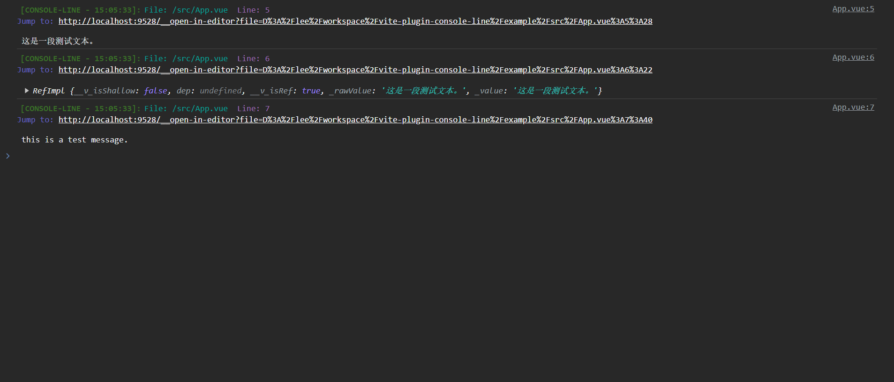
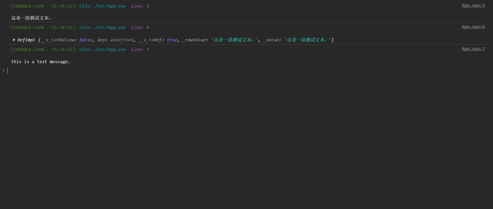

# vite-plugin-console-line
[English](./README.md) 中文
> 一个展示 **console.log(xx)** 文件位置和代码行数的vite插件.

# 用法

```javascript
import consoleLine from "vite-plugin-console-line";

const viteConfig = defineConfig({
  // ...
  plugins: [consoleLine({ exclude: ["node_modules"], port: 9528 })],
  // ...
});
```
# 参数
* **exclude** : 你不想转换的文件路径. 

* **port** : 如果你想从浏览器跳转到编辑器，那么你应该设置该字段，字段值为代理服务器的端口。


在调试代码时，你可以在浏览器的控制台中查看 console.log() 语句的文件位置和行号信息。点击链接会带你返回到编辑器并导航到当前 console.log() 语句所在的位置。



有时候，你可能只需要显示 console.log() 的文件位置和行号。在这种情况下，传递参数时你可以省略 port 字段。



# 关于 **Open In Editor**

`跳转至编辑器`功能依赖于[launch-editor](https://github.com/yyx990803/launch-editor)。
